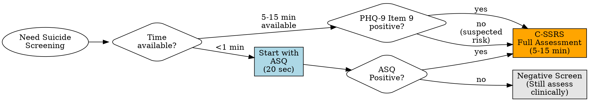
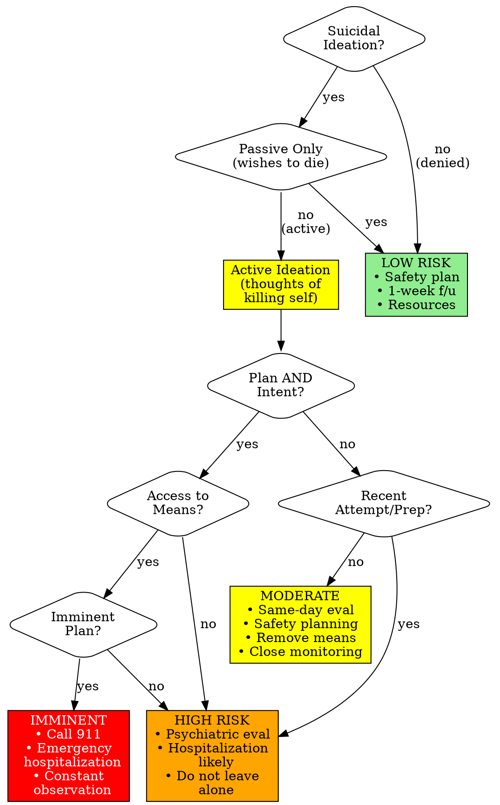

# Suicide Risk Screening

## Description

This skill helps administer and interpret validated suicide risk screening instruments. The ASQ provides a brief initial screening, while the C-SSRS (Columbia-Suicide Severity Rating Scale) offers comprehensive assessment of suicidal ideation and behavior.

**Clinical Context:** These tools help identify individuals at risk for suicide, assess severity of suicidal thinking, and guide clinical decision-making about safety interventions. They are support tools that supplement, not replace, comprehensive suicide risk assessment and clinical judgment.

## ⚠️ CRITICAL SAFETY NOTICE

**ANY positive suicide screen requires IMMEDIATE action. DO NOT leave patient alone. Comprehensive risk assessment and safety planning required before patient leaves your care.**

**Universal crisis protocols:** [../../docs/references/crisis-protocols.md](../../docs/references/crisis-protocols.md)

## Quick Reference

### Assessment Comparison

| Assessment | Items | Time | Purpose | When Positive | When to Use |
|------------|-------|------|---------|--------------|-------------|
| **ASQ** | 4 (+1 acuity) | 20 sec | Brief screening | Any "yes" | Quick triage, medical settings |
| **C-SSRS** | Multiple sections | 5-15 min | Comprehensive assessment | Determines risk level | Full assessment, positive ASQ |

**For detailed comparison:** See [references/screening-comparison.md](references/screening-comparison.md)

### Risk Level Quick Reference

| Risk Level | Ideation | Plan/Intent | Behavior | Immediate Action |
|------------|----------|-------------|----------|------------------|
| **Low** | Passive or none | None | None recent | Safety plan, 1-week follow-up |
| **Moderate** | Active, vague | Uncertain | Past attempt (not recent) | Same-day eval, intensive monitoring |
| **High** | Active, specific | Intent present | Recent attempt/preparatory | Psychiatric hospitalization likely |
| **Imminent** | Active, immediate | Has means, immediate intent | Attempt in progress | Call 911, emergency hospitalization |

**For detailed risk levels:** See [references/risk-levels.md](references/risk-levels.md)

## Interactive Administration (Optional)

Use this mode when the clinician says "start" or "administer" ASQ or C-SSRS.

1. Confirm readiness and ensure a safe setting; if the patient is in crisis, initiate emergency protocols immediately.
2. Ask one item at a time (verbatim from the asset file) and wait for a response before continuing.
3. If any response is positive, **pause the screening** and move immediately to comprehensive risk assessment and safety planning.
4. For ASQ: any "yes" requires the acuity question and full assessment.
5. For C-SSRS: follow the sections in order; if imminent risk is identified, stop and implement safety interventions.
6. Document risk level, protective factors, and immediate actions.

## Assessment Tools

### ASQ (Ask Suicide-Screening Questions)

**Complete assessment:** [assets/asq.md](assets/asq.md)

**4 questions (20 sec), Ages 10+.** Any "yes" = positive → comprehensive assessment required.

**Questions:** (1) Wished dead? (2) Family better off without you? (3) Thoughts of killing yourself? (4) Ever tried?
**If positive → Ask:** "Thoughts right now?"

### C-SSRS (Columbia-Suicide Severity Rating Scale)

**Complete assessment:** [assets/c-ssrs.md](assets/c-ssrs.md)

**5-15 minutes.** Multiple sections: ideation (severity 0-5), intensity, behavior (attempts, prep acts), timeline. Determines risk level with clinical judgment.

## Clinical Workflow

### 1. Choose Assessment

### 2. Administer Assessment

**ASQ:** [assets/asq.md](assets/asq.md) - 4 questions, 20 seconds
**C-SSRS:** [assets/c-ssrs.md](assets/c-ssrs.md) - Multiple sections, 5-15 minutes

### 3. Determine Risk Level

#### Risk Assessment Decision Tree

**Use comprehensive protocol:**
→ [references/risk-assessment-protocol.md](references/risk-assessment-protocol.md)

**Integrate all factors:**
- Ideation (presence, frequency, intensity)
- Plan and intent (specificity, access to means)
- Behavior (attempts, preparatory acts)
- Protective factors (reasons for living, social support)
- Risk factors (prior attempts, mental illness, substance use)
- Mental status (hopelessness, agitation, impulsivity)

**Risk levels:** See [references/risk-levels.md](references/risk-levels.md)

### 4. Immediate Safety Interventions

**ALL risk levels:**
- Create safety plan (see [references/safety-planning.md](references/safety-planning.md))
- Provide crisis resources
- Remove means when possible
- Document thoroughly

**Moderate-High risk:**
- Same-day psychiatric evaluation
- Intensive monitoring
- Remove ALL lethal means
- Involve support system

**High-Imminent risk:**
- Call 911 or crisis team
- DO NOT leave alone
- Emergency hospitalization

### 5. Document

**Use documentation templates in:**
- [assets/asq.md](assets/asq.md#documentation-template)
- [assets/c-ssrs.md](assets/c-ssrs.md#documentation-template)
- [references/risk-assessment-protocol.md](references/risk-assessment-protocol.md#documentation)

**Documentation standards:** [../../docs/references/documentation-standards.md](../../docs/references/documentation-standards.md)

## ⚠️ CRITICAL SAFETY PROTOCOLS

**ANY positive response:** (1) DO NOT leave patient alone, (2) Comprehensive assessment, (3) Assess plan/intent/means, (4) Remove lethal means, (5) Determine risk level, (6) Intervene appropriately, (7) Document thoroughly, (8) Ensure continuous safety.

**Essential questions:** Plan? Access to means? Intent to act? When? What's kept you safe? Prior attempts? **Complete protocol:** [references/risk-assessment-protocol.md](references/risk-assessment-protocol.md)

**Crisis resources (provide ALL patients):** 988 Lifeline (call/text), Text HOME to 741741, Veterans: 988 press 1 or text 838255, Trevor Project (LGBTQ+ youth): 1-866-488-7386, Emergency: 911.

**Safety planning (required all risk levels):** Warning signs, coping strategies, distraction, support contacts, crisis services, means restriction, reasons for living. **Guide:** [references/safety-planning.md](references/safety-planning.md)

**Means restriction (CRITICAL, saves lives):** Firearms—remove completely (preferred) or lock separately from ammunition with someone else controlling access. Medications—remove excess, family/pharmacy holds, weekly dispensing. Other—remove based on plan (ropes, cords, chemicals).

**NEVER:** Leave patient alone, assume others will handle, accept "I'm fine" without assessment, discharge without safety plan, minimize suicidal statements, skip means restriction, use "no-suicide contracts" (not evidence-based).

## Special Considerations

**High-risk populations:** Adolescents (impulsivity, social media), LGBTQ+ individuals (minority stress), veterans (combat trauma, firearm access), older adults (isolation, higher lethality), post-discharge patients (first weeks post-hospitalization).

**Screen when:** Severe depression (PHQ-9 ≥15), psychosis, substance use, PTSD, chronic pain, terminal illness, recent loss. See [PHQ-9 Item 9 protocol](../depression-screening/references/item-9-safety-protocol.md).

**Cultural:** Ask directly across cultures; expression varies; use interpreters; understand protective factors.

## Referral Guidelines

### When to Refer/Hospitalize

**Immediate (Emergency Services/911):**
- Imminent risk (plan, intent, means, immediate)
- Attempt in progress
- Cannot keep self safe
- Psychosis with command hallucinations

**Urgent (Same-Day Psychiatric Evaluation):**
- High risk (plan and intent but not imminent)
- Moderate risk unable to safety plan
- Recent attempt (past week)

**Routine (Within 1-3 Days):**
- Low risk needing mental health treatment
- Moderate risk with good safety plan
- Follow-up after higher level of care

**Complete referral guidance:** [../../docs/references/referral-guidelines.md](../../docs/references/referral-guidelines.md)

## Limitations

**Cannot predict suicide with certainty.** Patients may not disclose; risk changes rapidly. Tools support clinical judgment, not replace it. Negative screen ≠ no risk. When in doubt: assess thoroughly, consult, err on side of safety.

## Usage Examples

**Example requests:** "Screen for suicide risk", "ASQ positive—what now?", "Guide C-SSRS", "Create safety plan", "Assess risk level"

## References

**Primary Literature:**
- Horowitz LM, et al. Ask Suicide-Screening Questions (ASQ). Arch Pediatr Adolesc Med. 2012;166(12):1170-1176.
- Posner K, et al. The Columbia-Suicide Severity Rating Scale. Am J Psychiatry. 2011;168(12):1266-1277.
- Stanley B, Brown GK. Safety Planning Intervention. Cognitive and Behavioral Practice. 2012;19(2):256-264.

**Clinical Guidelines:**
- American Psychiatric Association. Practice guideline for assessment and treatment of patients with suicidal behaviors. 2003.
- VA/DoD Clinical Practice Guideline for Assessment and Management of Patients at Risk for Suicide. 2019.

**Resources:**
- NIMH ASQ Toolkit: nimh.nih.gov/asq
- C-SSRS: cssrs.columbia.edu
- 988 Suicide & Crisis Lifeline: 988lifeline.org

**Freely available - NIMH (ASQ) and Columbia University (C-SSRS)**

**⚠️ This skill addresses life-threatening situations. ALL safety protocols must be followed without exception.**
