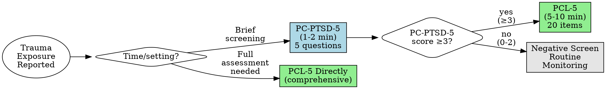
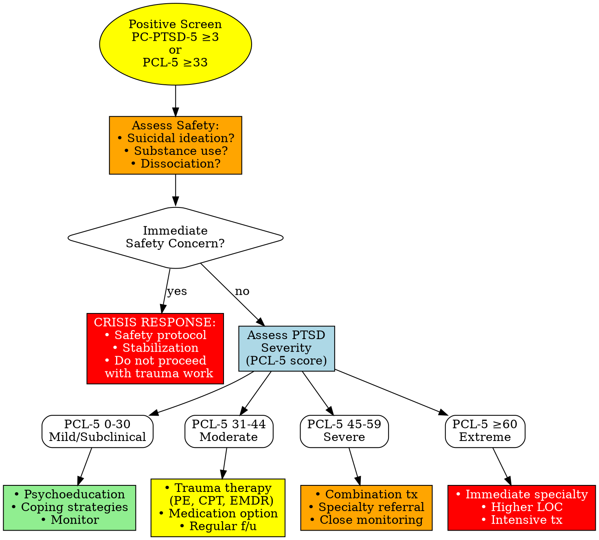

# Trauma Screening

## Description

This skill helps administer and interpret validated PTSD and trauma screening instruments. The PC-PTSD-5 serves as a brief initial screener, while the PCL-5 provides comprehensive assessment of PTSD symptom severity aligned with DSM-5 criteria.

**Clinical Context:** These tools help identify probable PTSD, quantify symptom severity, track treatment response, and support clinical decision-making. They are support tools that supplement, not replace, comprehensive trauma-informed clinical evaluation.

**⚠️ TRAUMA-INFORMED APPROACH REQUIRED:** All trauma screening must follow trauma-informed principles. See [references/trauma-informed-approach.md](references/trauma-informed-approach.md) for essential guidance.

## Quick Reference: Assessment Selection

| Assessment | Items | Time | Purpose | Cutoff | When to Use |
|------------|-------|------|---------|--------|-------------|
| **PC-PTSD-5** | 5 | 1-2 min | Brief screen | ≥3 | Primary care, triage, initial screening |
| **PCL-5** | 20 | 5-10 min | Comprehensive assessment | ≥33 | After positive PC-PTSD-5, treatment monitoring |

**Decision guide:** Start with PC-PTSD-5 for quick screening. If score ≥3, administer full PCL-5. See [references/screening-comparison.md](references/screening-comparison.md) for detailed guidance.

### Assessment Selection Decision Tree

## Usage

**Example requests:** "Screen for PTSD", "Administer PCL-5", "Score trauma screening", "Interpret PTSD results"

## Quick Reference: Severity Levels

### PC-PTSD-5 Interpretation
- **0-2:** Negative screen - PTSD unlikely, routine monitoring
- **≥3:** Positive screen - Administer full PCL-5 for comprehensive assessment

### PCL-5 Severity Levels
- **0-30:** Subclinical/mild - Watchful waiting, psychoeducation
- **31-44:** Moderate PTSD - Evidence-based trauma therapy recommended
- **45-59:** Severe PTSD - Active treatment strongly recommended, specialty referral
- **≥60:** Extreme PTSD - Immediate intervention, consider higher level of care

**Treatment response:** 10-20 point decrease = clinically significant improvement

For detailed severity interpretations and treatment recommendations, see [references/severity-levels.md](references/severity-levels.md)

## Interactive Administration (Optional)

Use this mode when the clinician says "start" or "administer" the PC-PTSD-5/PCL-5.

1. Confirm readiness, use a trauma-informed approach, and remind the patient they can pause or skip questions.
2. Explain the time frame and response scale for the selected instrument.
3. Ask one item at a time (verbatim from the asset file) and wait for a response before continuing.
4. Accept numeric or verbal responses; if unclear or out of range, ask for clarification.
5. If the patient becomes distressed or safety concerns arise, pause and follow trauma-informed safety guidance before continuing.
6. After the final item, calculate totals (and cluster scores for PCL-5), interpret severity, and provide next-step guidance.
7. Offer a brief documentation summary if requested.

## Assessment Administration

### PC-PTSD-5 (Primary Care PTSD Screen for DSM-5)

**Complete assessment details:** [assets/pc-ptsd-5.md](assets/pc-ptsd-5.md)

**Quick Facts:**
- 5 binary (Yes/No) questions covering DSM-5 PTSD symptom clusters
- Score 1 point for each "Yes" response
- Cutoff ≥3: Optimal balance of sensitivity (93%) and specificity (85%)
- Positive screen indicates need for full PTSD assessment (PCL-5)
- Requires trauma exposure; not administered if no trauma history

**Items (1 point each for "Yes"):**
1. Nightmares/intrusive thoughts about trauma
2. Avoidance of trauma reminders
3. Hypervigilance/easily startled
4. Detachment/numbing
5. Guilt/self-blame

**Next Steps:**
- Score 0-2: Monitor, reassess if symptoms emerge
- Score ≥3: **Administer full PCL-5** for comprehensive assessment

### PCL-5 (PTSD Checklist for DSM-5)

**Complete assessment details:** [assets/pcl-5.md](assets/pcl-5.md)

**Quick Facts:**
- 20 items mapping to DSM-5 PTSD criteria (0-4 Likert scale)
- Total score range: 0-80
- Cutoff ≥33: Probable PTSD diagnosis (requires clinical interview to confirm)
- Tracks symptom severity and treatment response
- Can assess DSM-5 diagnostic criteria via cluster analysis

**Symptom Clusters:**
- **Cluster B (Items 1-5):** Intrusion symptoms (range 0-20)
- **Cluster C (Items 6-7):** Avoidance (range 0-8)
- **Cluster D (Items 8-14):** Negative cognitions/mood (range 0-28)
- **Cluster E (Items 15-20):** Arousal/reactivity (range 0-24)

**DSM-5 Provisional Diagnosis Criteria:**
- ≥1 Cluster B item rated ≥2 (Moderately or higher)
- ≥1 Cluster C item rated ≥2
- ≥2 Cluster D items rated ≥2
- ≥2 Cluster E items rated ≥2

**Clinical Cutoffs:**
- Total score ≥33: Probable PTSD (clinical interview required for formal diagnosis)
- 10-20 point change: Clinically significant improvement
- 5-10 point change: Reliable improvement

## Clinical Decision-Making

### Trauma-Informed Response Pathway

For structured clinical decision trees covering screening, treatment selection, safety assessment, and treatment monitoring, see [references/clinical-decision-trees.md](references/clinical-decision-trees.md)

**⚠️ Safety-First:** Assess for suicidal ideation (use suicide-screening), substance use, dissociation. Do NOT begin trauma work if safety concerns present.

**Evidence-Based Therapies:** PE, CPT, EMDR, TF-CBT

**Medications:** SSRIs (sertraline, paroxetine, fluoxetine), SNRI (venlafaxine)

## Safety Protocols

**⚠️ TRAUMA-INFORMED CARE REQUIRED:** Follow trauma-informed principles (safety/trust, voluntary participation, patient-controlled pacing, prepare for emotional reactions). See [references/trauma-informed-approach.md](references/trauma-informed-approach.md).

**Safety Assessment:** Screen for suicidal ideation (use ../../suicide-screening/), assess current safety. Crisis intervention required per [../../docs/references/crisis-protocols.md](../../docs/references/crisis-protocols.md).

**Crisis Resources:** 988 Lifeline, Text HOME to 741741, Veterans 988 Press 1, Emergency 911

**Escalate when:** Active SI, severe impairment, PCL-5 ≥60, psychotic symptoms, severe self-harm

## Documentation

**PC-PTSD-5 template:** [assets/pc-ptsd-5.md](assets/pc-ptsd-5.md) - Include trauma exposure, item responses, score (0-5), result, next steps.

**PCL-5 template:** [assets/pcl-5.md](assets/pcl-5.md) - Include all 20 items (0-4), cluster subtotals, total score, severity, DSM-5 criteria met, provisional diagnosis, treatment recommendations, safety assessment.

**Standards:** [../../docs/references/documentation-standards.md](../../docs/references/documentation-standards.md)

## Limitations & Considerations

**Support tool, not diagnostic:** PCL-5 provides provisional diagnosis; clinical interview required. Scores require interpretation within trauma context. Cultural factors and dissociation affect reporting. Clinical judgment supersedes scores. Use collaborative, trauma-informed approach respecting autonomy and timing. See [references/trauma-informed-approach.md](references/trauma-informed-approach.md).

**Special Populations:** Military/veterans (combat context), complex trauma (developmental/relational impact), childhood trauma (attachment issues), recent trauma <1 month (acute stress vs PTSD).

**Comorbidity:** PTSD commonly co-occurs with depression (50%), substance use (30-50%), anxiety. Screen with ../../depression-screening/, ../../substance-screening/, ../../anxiety-screening/. Address in treatment planning.

## Workflow Integration

**Related workflows:** ../../intake-interview/ (comprehensive intake), ../../treatment-planning/ (trauma treatment plans), ../../documentation/ (progress notes). See [../../docs/references/crisis-protocols.md](../../docs/references/crisis-protocols.md) and [../../docs/references/referral-guidelines.md](../../docs/references/referral-guidelines.md).

## Additional Resources

**For detailed guidance, see:**
- **[references/severity-levels.md](references/severity-levels.md)** - Complete severity interpretations for PC-PTSD-5 and PCL-5
- **[references/screening-comparison.md](references/screening-comparison.md)** - When to use PC-PTSD-5 vs PCL-5
- **[references/clinical-decision-trees.md](references/clinical-decision-trees.md)** - Treatment selection, monitoring, and escalation
- **[references/trauma-informed-approach.md](references/trauma-informed-approach.md)** - Essential trauma-informed screening techniques

## References

**PC-PTSD-5:**
- Prins A, Bovin MJ, Smolenski DJ, et al. The Primary Care PTSD Screen for DSM-5 (PC-PTSD-5): Development and evaluation within a veteran primary care sample. J Gen Intern Med. 2016;31(10):1206-1211.

**PCL-5:**
- Weathers FW, Litz BT, Keane TM, Palmieri PA, Marx BP, Schnurr PP. The PTSD Checklist for DSM-5 (PCL-5). National Center for PTSD, 2013.
- Bovin MJ, et al. Psychometric properties of the PTSD Checklist for Diagnostic and Statistical Manual of Mental Disorders–Fifth Edition (PCL-5) in veterans. Psychological Assessment. 2016;28(11):1379-1391.

**Public domain - VA National Center for PTSD, freely available for clinical and research use**
