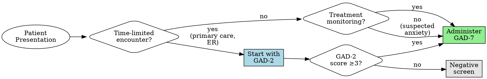
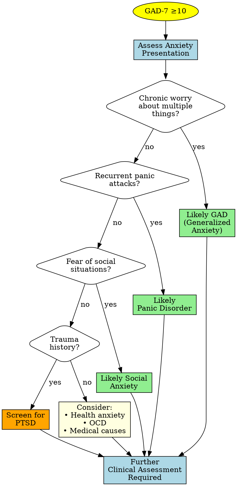

# Anxiety Screening

## Description

This skill helps administer and interpret validated anxiety screening instruments. The GAD-2 serves as a brief initial screener, while the GAD-7 provides comprehensive assessment of generalized anxiety severity.

**Clinical Context:** These tools help quantify anxiety symptoms, track treatment response, and support clinical decision-making. The GAD-7 also screens reasonably well for panic disorder, social anxiety, and PTSD. These are support tools that supplement, not replace, comprehensive clinical evaluation.

## Quick Reference

### Assessment Comparison

| Assessment | Items | Time | Purpose | Cutoff | When to Use |
|------------|-------|------|---------|--------|-------------|
| **GAD-2** | 2 | <1 min | Brief screening | ≥3 → Full GAD-7 | Time-limited settings, universal screening |
| **GAD-7** | 7 | 2-3 min | Severity assessment | ≥10 = Moderate+ | Comprehensive assessment, treatment monitoring |

**For detailed comparison:** See [references/screening-comparison.md](references/screening-comparison.md)

### GAD-7 Severity Levels

| Score | Severity | First-Line Treatment | Follow-up |
|-------|----------|---------------------|-----------|
| 0-4 | Minimal | Monitor, psychoeducation | Annual or as needed |
| 5-9 | Mild | Relaxation/stress management | 2-4 weeks |
| 10-14 | Moderate | Therapy or medication | 2-4 weeks |
| 15-21 | Severe | Combination therapy, specialty referral | 1-2 weeks |

**For detailed severity interpretations:** See [references/severity-levels.md](references/severity-levels.md)

**For treatment recommendations:** See [references/clinical-decision-trees.md](references/clinical-decision-trees.md)

## Interactive Administration (Optional)

Use this mode when the clinician says "start" or "administer" the GAD-2/GAD-7.

1. Confirm readiness and explain the past 2 weeks time frame plus the 0-3 response scale.
2. Ask one item at a time (verbatim from the asset file) and wait for a response before continuing.
3. Accept numeric or verbal responses; if unclear or out of range, ask for clarification.
4. Record each response and keep a running total.
5. If responses indicate severe anxiety or there is any safety concern, pause and assess safety (see Safety Considerations).
6. After the final item, calculate the total score, interpret severity, and provide next-step guidance.
7. Offer a brief documentation summary if requested.

## Assessment Tools

### GAD-7 (Generalized Anxiety Disorder-7)

**Complete assessment with items, scoring, and documentation:**
→ [assets/gad-7.md](assets/gad-7.md)

**Key Facts:**
- **7 items**, 0-3 scale each, total score 0-21
- **Cutoff ≥10:** 89% sensitivity/82% specificity for GAD
- **5-point change:** Indicates treatment response
- **Validated** for screening GAD, panic, social anxiety, PTSD
- **Does NOT:** Include safety item (screen for suicidal ideation with PHQ-9 if needed)

### GAD-2 (Generalized Anxiety Disorder-2)

**Complete assessment with items, scoring, and documentation:**
→ [assets/gad-2.md](assets/gad-2.md)

**Key Facts:**
- **2 items** (first 2 from GAD-7), 0-3 scale each, total score 0-6
- **Cutoff ≥3:** Positive screen → administer full GAD-7
- **Use for:** Rapid screening, universal screening in time-limited settings
- **Does NOT:** Assess severity or screen for suicidal ideation

**When to use GAD-2 vs GAD-7:** See [references/screening-comparison.md](references/screening-comparison.md)

## Clinical Workflow

### 1. Choose Assessment

### 2. Administer Assessment

**GAD-2:** [assets/gad-2.md](assets/gad-2.md) - 2 items, <1 minute
**GAD-7:** [assets/gad-7.md](assets/gad-7.md) - 7 items, 2-3 minutes

### 3. Score and Interpret

**Scoring:**
- Sum all item responses
- GAD-2: 0-6 range
- GAD-7: 0-21 range

**Interpretation:**
- See quick reference table above
- Detailed interpretations: [references/severity-levels.md](references/severity-levels.md)

### 4. Clinical Decision-Making

**Follow clinical decision trees:** [references/clinical-decision-trees.md](references/clinical-decision-trees.md)

**General pathways:**
- **GAD-7 0-4:** Monitor, psychoeducation
- **GAD-7 5-9:** Relaxation techniques, stress management, watchful waiting
- **GAD-7 10-14:** Active treatment (CBT or medication)
- **GAD-7 15-21:** Combination therapy, specialty referral

### 5. Document

**Use documentation templates in:**
- [assets/gad-2.md](assets/gad-2.md#documentation-template)
- [assets/gad-7.md](assets/gad-7.md#documentation-template)

**Documentation standards:** [../../docs/references/documentation-standards.md](../../docs/references/documentation-standards.md)

## Treatment Monitoring

**Use GAD-7 to track progress:**
- **Baseline:** Administer at treatment start
- **Follow-up:** Every 2-4 weeks during active treatment
- **Response indicators:**
  - <5-point decrease: Minimal response (consider treatment change)
  - 5-9 point decrease: Partial response (continue, monitor)
  - ≥5-point decrease AND score <10: Good response
  - Score <5: Remission (treatment goal)

**Do NOT use GAD-2 for treatment monitoring** - insufficient detail

## Safety Considerations

### GAD-7 Does NOT Screen for Suicidal Ideation

**Important:** Unlike PHQ-9, GAD-7 has no safety item

**When to assess suicidal ideation:**
- Severe anxiety (GAD-7 ≥15)
- Co-occurring depression
- Any clinical concern

**How to assess:**
- Administer PHQ-9 (includes Item 9 for suicidal ideation)
- Direct clinical questioning
- See [../depression-screening/references/item-9-safety-protocol.md](../depression-screening/references/item-9-safety-protocol.md)

**Always assess:**
- Panic attacks and their impact
- Avoidance behaviors affecting functioning
- Substance use (especially self-medication)
- Co-occurring depression (administer PHQ-9)

**Crisis Resources:**
- **988 Suicide & Crisis Lifeline** (call or text)
- **Crisis Text Line:** Text HOME to 741741
- **Emergency:** 911

**Universal crisis protocols:** [../../docs/references/crisis-protocols.md](../../docs/references/crisis-protocols.md)

## Special Considerations

### Differential Diagnosis

#### When GAD-7 is Elevated

**Note:** GAD-7 screens for anxiety severity but does not differentiate specific disorders. Further clinical assessment required for diagnosis.

- **Medical causes:** Rule out hyperthyroidism, cardiac arrhythmias, respiratory conditions, caffeine/substances, medication side effects
- **Co-occurring depression:** Very common (60% overlap)—administer both GAD-7 and PHQ-9, integrated treatment
- **Substance use:** May be self-medication; substances worsen anxiety; withdrawal causes anxiety
- **Cultural factors:** Expression varies across cultures; use validated versions
- **Age:** Validated for teens (12+) and older adults; different tools for children <12

## Referral Guidelines

### When to Refer to Specialty Mental Health

**Immediate/Urgent:**
- GAD-7 ≥15 at initial presentation
- Severe functional impairment
- Inadequate response to initial treatment
- Patient request for specialty care

**Routine:**
- GAD-7 10-14 if patient prefers specialist
- Complex presentation (trauma, substance use)
- Need for specialized anxiety treatment (exposure therapy, etc.)

**Complete referral guidance:** [../../docs/references/referral-guidelines.md](../../docs/references/referral-guidelines.md)

## Limitations

**Screening tools, not diagnostic instruments.** Do not replace clinical assessment; do not differentiate specific anxiety disorders. Clinical judgment supersedes scores. Potential issues: false positives (medical conditions, substances), false negatives (minimization), cultural/linguistic factors.

## Usage Examples

**Example requests:** "Administer GAD-7", "Screen for anxiety", "Score GAD-7", "Treatment for score 17", "Screen anxiety and depression together?"

## References

**Primary Literature:**
- Spitzer RL, Kroenke K, Williams JB, Löwe B. A brief measure for assessing generalized anxiety disorder: the GAD-7. Arch Intern Med. 2006;166(10):1092-1097.
- Kroenke K, Spitzer RL, Williams JB, Monahan PO, Löwe B. Anxiety disorders in primary care: prevalence, impairment, comorbidity, and detection. Ann Intern Med. 2007;146(5):317-325.

**Clinical Guidelines:**
- Bandelow B, et al. Treatment of anxiety disorders. Dialogues Clin Neurosci. 2017;19(2):93-107.
- Katzman MA, et al. Canadian clinical practice guidelines for the management of anxiety. BMC Psychiatry. 2014;14 Suppl 1:S1.

**No copyright restrictions - GAD-2 and GAD-7 are freely available for clinical and research use**
