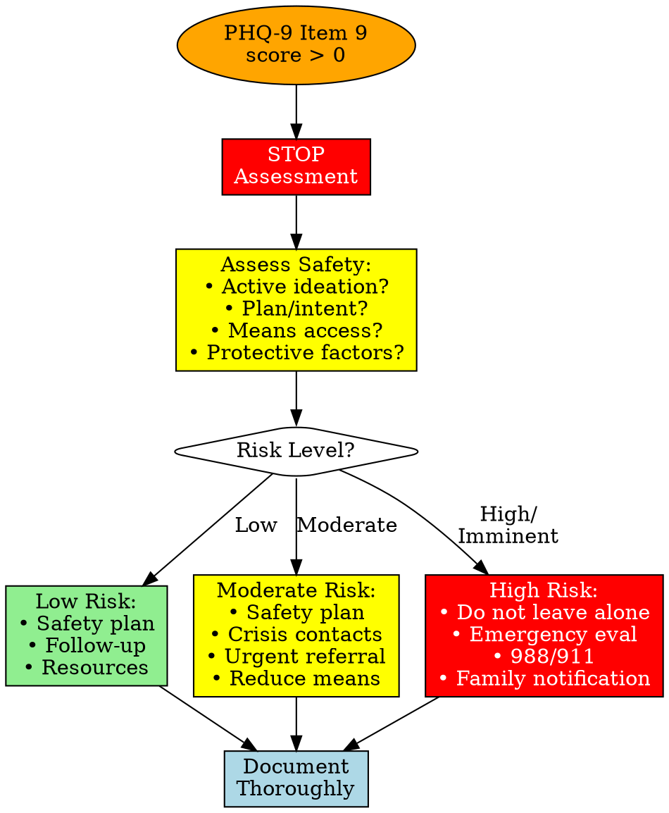
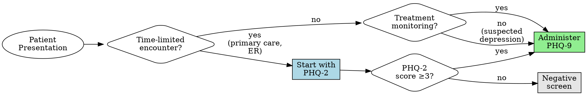
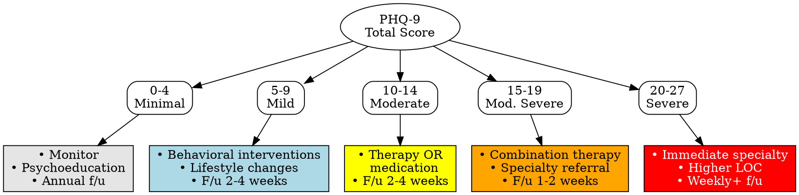

# Depression Screening

## Description

This skill helps administer and interpret validated depression screening instruments. The PHQ-2 serves as a brief initial screener, while the PHQ-9 provides comprehensive assessment of depression severity aligned with DSM criteria.

**Clinical Context:** These tools help quantify depression symptoms, track treatment response, and support clinical decision-making. They are support tools that supplement, not replace, comprehensive clinical evaluation.

## Quick Reference

### Assessment Comparison

| Assessment | Items | Time | Purpose | Cutoff | When to Use |
|------------|-------|------|---------|--------|-------------|
| **PHQ-2** | 2 | <1 min | Brief screening | ≥3 → Full PHQ-9 | Time-limited settings, universal screening |
| **PHQ-9** | 9 | 2-3 min | Severity assessment | ≥10 = Moderate+ | Comprehensive assessment, treatment monitoring |

**For detailed comparison:** See [references/screening-comparison.md](references/screening-comparison.md)

### PHQ-9 Severity Levels

| Score | Severity | First-Line Treatment | Follow-up |
|-------|----------|---------------------|-----------|
| 0-4 | Minimal | Monitor, psychoeducation | Annual or as needed |
| 5-9 | Mild | Behavioral interventions | 2-4 weeks |
| 10-14 | Moderate | Therapy or medication | 2-4 weeks |
| 15-19 | Moderately Severe | Combination therapy, specialty referral | 1-2 weeks |
| 20-27 | Severe | Specialty referral, higher level of care | Weekly+ |

**For detailed severity interpretations:** See [references/severity-levels.md](references/severity-levels.md)

**For treatment recommendations:** See [references/clinical-decision-trees.md](references/clinical-decision-trees.md)

## ⚠️ CRITICAL SAFETY WARNING

### PHQ-9 Item 9: Suicidal Ideation

**Item 9:** "Thoughts that you would be better off dead or of hurting yourself in some way"

**ANY score > 0 on Item 9 requires IMMEDIATE action:**
1. **Stop** and address immediately - do not wait until end of assessment
2. **Assess** safety fully (ideation, plan, intent, means, protective factors)
3. **Intervene** based on risk level (safety plan, crisis resources, emergency evaluation)
4. **Document** thoroughly

#### Item 9 Response Protocol

**See detailed protocol:** [references/item-9-safety-protocol.md](references/item-9-safety-protocol.md)

**Crisis Resources:**
- **988 Suicide & Crisis Lifeline** (call or text)
- **Crisis Text Line:** Text HOME to 741741
- **Emergency:** 911

**Universal crisis protocols:** [../../docs/references/crisis-protocols.md](../../docs/references/crisis-protocols.md)

## Interactive Administration (Optional)

Use this mode when the clinician says "start" or "administer" the PHQ-2/PHQ-9.

1. Confirm readiness and explain the past 2 weeks time frame plus the 0-3 response scale.
2. Ask one item at a time (verbatim from the asset file) and wait for a response before continuing.
3. Accept numeric or verbal responses; if unclear or out of range, ask for clarification.
4. Record each response and keep a running total.
5. **Item 9 safety rule:** If Item 9 > 0, STOP and follow the Item 9 safety protocol before continuing.
6. After the final item, calculate the total score, interpret severity, and provide next-step guidance.
7. Offer a brief documentation summary if requested.

## Assessment Tools

### PHQ-9 (Patient Health Questionnaire-9)

**Complete assessment with items, scoring, and documentation:**
→ [assets/phq-9.md](assets/phq-9.md)

**Key Facts:**
- **9 items**, 0-3 scale each, total score 0-27
- **Cutoff ≥10:** 88% sensitivity/specificity for major depression
- **Item 9:** Screens for suicidal ideation - requires immediate follow-up if positive
- **Treatment response:** 5-point decrease = response, 10-point = clinically significant
- **Validated** for screening, diagnosis support, and treatment monitoring

### PHQ-2 (Patient Health Questionnaire-2)

**Complete assessment with items, scoring, and documentation:**
→ [assets/phq-2.md](assets/phq-2.md)

**Key Facts:**
- **2 items** (first 2 from PHQ-9), 0-3 scale each, total score 0-6
- **Cutoff ≥3:** Positive screen → administer full PHQ-9
- **Use for:** Rapid screening, universal screening in time-limited settings
- **Does NOT:** Assess severity or include suicidal ideation screening

**When to use PHQ-2 vs PHQ-9:** See [references/screening-comparison.md](references/screening-comparison.md)

## Clinical Workflow

### 1. Choose Assessment

### 2. Administer Assessment

**PHQ-2:** [assets/phq-2.md](assets/phq-2.md) - 2 items, <1 minute
**PHQ-9:** [assets/phq-9.md](assets/phq-9.md) - 9 items, 2-3 minutes

### 3. Score and Interpret

**Scoring:**
- Sum all item responses
- PHQ-2: 0-6 range
- PHQ-9: 0-27 range

**Interpretation:**
- See quick reference table above
- Detailed interpretations: [references/severity-levels.md](references/severity-levels.md)

**⚠️ Check Item 9 immediately** - if positive, see safety protocol

### 4. Clinical Decision-Making

#### Treatment Decision Pathway

**Follow clinical decision trees:** [references/clinical-decision-trees.md](references/clinical-decision-trees.md)

**⚠️ Any Item 9 > 0:** Follow safety protocol regardless of total score

### 5. Document

**Use documentation templates in:**
- [assets/phq-2.md](assets/phq-2.md#documentation-template)
- [assets/phq-9.md](assets/phq-9.md#documentation-template)

**Documentation standards:** [../../docs/references/documentation-standards.md](../../docs/references/documentation-standards.md)

## Treatment Monitoring

**Use PHQ-9 to track progress:**
- **Baseline:** Administer at treatment start
- **Follow-up:** Every 2-4 weeks during active treatment
- **Response indicators:**
  - <5-point decrease: Minimal response (consider treatment change)
  - 5-9 point decrease: Partial response (continue, monitor)
  - ≥10-point decrease: Clinically significant improvement
  - Score <5: Remission (treatment goal)

**Do NOT use PHQ-2 for treatment monitoring** - insufficient detail

## Special Considerations

- **Medical comorbidity:** Physical illness elevates somatic scores (items 3,4,5,8)—interpret in context, treat depression regardless
- **Cultural factors:** Symptom expression varies; use culturally validated versions when available
- **Age:** PHQ-A for adolescents; validated for older adults; different tools for children <12
- **Substance use:** Can confound scores; assess post-detox for baseline; integrated treatment required

## Referral Guidelines

### When to Refer to Specialty Mental Health

**Immediate/Urgent:**
- PHQ-9 ≥15 at initial presentation
- Any suicidal ideation (Item 9 > 0)
- Inadequate response to initial treatment
- Patient request for specialty care

**Routine:**
- PHQ-9 10-14 if patient prefers specialist
- Complex presentation (trauma, substance use, medical comorbidity)
- Need for specialized therapy

**Complete referral guidance:** [../../docs/references/referral-guidelines.md](../../docs/references/referral-guidelines.md)

## Limitations

**Screening tools, not diagnostic instruments.** Do not replace clinical assessment. Clinical judgment supersedes scores. Potential issues: false positives (medical illness), false negatives (minimization, literacy), cultural/linguistic factors.

## Usage Examples

**Example requests:** "Administer PHQ-9", "Screen for depression", "Score and interpret PHQ-9", "Treatment for score 16", "Item 9 positive—what now?"

## References

**Primary Literature:**
- Kroenke K, Spitzer RL, Williams JB. The PHQ-9: validity of a brief depression severity measure. J Gen Intern Med. 2001;16(9):606-613.
- Kroenke K, Spitzer RL, Williams JB. The Patient Health Questionnaire-2: validity of a two-item depression screener. Med Care. 2003;41(11):1284-1292.

**Clinical Guidelines:**
- American Psychological Association. (2019). Clinical Practice Guideline for the Treatment of Depression.
- Veterans Affairs/DoD. (2022). Clinical Practice Guideline for Management of Major Depressive Disorder.

**No copyright restrictions - PHQ-2 and PHQ-9 are freely available for clinical and research use**
