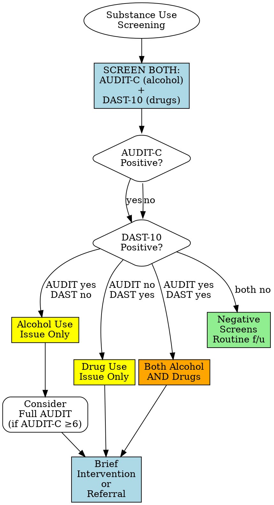
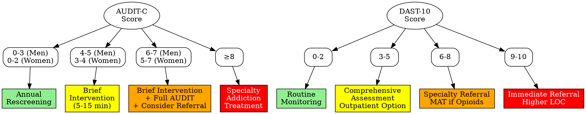

# Substance Use Screening

## Description

This skill helps administer and interpret validated substance use screening instruments. The AUDIT-C assesses alcohol use patterns, while the DAST-10 screens for drug use problems.

**Clinical Context:** These tools help identify problematic substance use, assess severity, and support clinical decision-making about further evaluation or intervention. They are support tools that supplement, not replace, comprehensive substance use assessment.

**IMPORTANT: Screen for BOTH alcohol (AUDIT-C) and drugs (DAST-10).** They often co-occur and require different assessment and treatment approaches.

## Quick Reference: Assessment Selection

| Assessment | Items | Time | Substance | Cutoff | When to Use |
|------------|-------|------|-----------|--------|-------------|
| **AUDIT-C** | 3 | < 1 min | Alcohol only | Men ≥4, Women ≥3 | Universal screening, primary care |
| **DAST-10** | 10 | 2-3 min | Drugs (not alcohol) | ≥3 | Universal screening, any clinical setting |
| **Full AUDIT** | 10 | 3-5 min | Alcohol only | ≥8 | After positive AUDIT-C, comprehensive assessment |

**Recommended approach:** Use AUDIT-C + DAST-10 together for complete substance use screening. See [references/screening-comparison.md](references/screening-comparison.md) for detailed guidance.

### Assessment Selection Decision Tree

## Interactive Administration (Optional)

Use this mode when the clinician says "start" or "administer" AUDIT-C and/or DAST-10.

1. Confirm whether to administer AUDIT-C, DAST-10, or both (recommended: both).
2. Explain the time frame and response format for each instrument.
3. Ask one item at a time (verbatim from the asset file) and wait for a response before continuing.
4. Accept numeric or verbal responses; if unclear or out of range, ask for clarification.
5. Record each response and keep running totals (remember DAST-10 Item 3 is reverse scored).
6. After each instrument, calculate totals, interpret severity, and provide next-step guidance.
7. Offer a brief documentation summary if requested.

## Usage

**Example requests:** "Screen for alcohol use", "Administer DAST-10", "Score AUDIT-C", "Interpret substance screening"

## Quick Reference: Severity Levels

### AUDIT-C Interpretation (Alcohol)

**Men:**
- **0-3:** Low risk - Annual rescreening
- **4-5:** Hazardous drinking - Brief intervention
- **6-7:** Harmful/high risk - Brief intervention + full AUDIT, consider referral
- **8-12:** Severe risk - Specialty addiction treatment referral required

**Women:**
- **0-2:** Low risk - Annual rescreening
- **3-4:** Hazardous drinking - Brief intervention
- **5-7:** Harmful/high risk - Brief intervention + full AUDIT, consider referral
- **8-12:** Severe risk - Specialty addiction treatment referral required

### DAST-10 Interpretation (Drugs)

- **0-2:** No/minimal risk - Routine monitoring
- **3-5:** Moderate risk - Comprehensive assessment, consider outpatient treatment
- **6-8:** Substantial risk - Specialty addiction treatment referral required
- **9-10:** Severe risk - Immediate specialty referral, higher level of care

For detailed severity interpretations and treatment recommendations, see [references/severity-levels.md](references/severity-levels.md)

## Assessment Administration

### AUDIT-C (Alcohol Use Disorders Identification Test - Concise)

**Complete details:** [assets/audit-c.md](assets/audit-c.md)

**Items (0-4 each):** 1) Drinking frequency, 2) Drinks per day, 3) Binge drinking frequency

**Scoring:** Total 0-12. Men ≥4, Women ≥3 = positive. **Standard drink:** 12oz beer, 5oz wine, 1.5oz spirits.

**Next Steps:** Below cutoff → annual rescreen. 4-7 (M) or 3-7 (W) → brief intervention, f/u 1-3mo. ≥8 → full AUDIT + referral.

### DAST-10 (Drug Abuse Screening Test - 10 Item)

**Complete details:** [assets/dast-10.md](assets/dast-10.md)

**Format:** 10 Yes/No questions, past 12 months, excludes alcohol/tobacco. Covers use beyond medical reasons, polysubstance, loss of control, blackouts, guilt, family issues, illegal activities, withdrawal, medical complications. Item 3 reverse scored.

**Scoring:** Total 0-10. 1 point per "Yes" (except Item 3). ≥3 = problematic use.

**Next Steps:** 0-2 → monitor. ≥3 → detailed history (substances, frequency, route). Opioids → MAT discussion. Injection use → infectious disease screening.

## Clinical Decision-Making

### Severity to Intervention Pathway

For structured clinical decision trees covering screening pathways, treatment selection, withdrawal management, and co-occurring disorders, see [references/clinical-decision-trees.md](references/clinical-decision-trees.md)

**Substance-Specific:** **Opioids:** MAT immediately (buprenorphine, methadone, naltrexone), naloxone for all. **Stimulants:** Behavioral therapies, cardiac/psychiatric evaluation. **Benzodiazepines:** Never abrupt stop (seizure risk), supervised taper required.

## Brief Intervention for Positive AUDIT-C (4-7 range)

**Components (5-15 min):** Provide feedback (compare to low-risk guidelines), assess readiness, set goals, provide resources, follow-up in 1-3 months. **Low-risk limits:** Men ≤14/week, ≤4/day; Women ≤7/week, ≤3/day.

## Safety Protocols

**Approach:** Non-judgmental, confidential. Normalize screening, use non-stigmatizing language.

**Immediate Concerns:** Acute intoxication/withdrawal → medical evaluation. Alcohol/benzodiazepine withdrawal → supervised detox (seizure risk). Opioids → MAT + naloxone. Injection use → infectious disease screening. Suicidal ideation → crisis intervention per [../../docs/references/crisis-protocols.md](../../docs/references/crisis-protocols.md).

**Crisis Resources:** SAMHSA 1-800-662-4357, 988 Lifeline, Text HOME to 741741, Emergency 911

## Documentation

**AUDIT-C template:** [assets/audit-c.md](assets/audit-c.md) - Include 3 items, score, gender/cutoff, result, risk level, brief intervention, follow-up.

**DAST-10 template:** [assets/dast-10.md](assets/dast-10.md) - Include 10 items, score, risk level, substances, red flags (injection/opioids/withdrawal), recommendations, safety, naloxone if needed.

**Standards:** [../../docs/references/documentation-standards.md](../../docs/references/documentation-standards.md)

## Limitations & Considerations

**Support tool, not diagnostic:** Self-report may underestimate use. Requires clinical context interpretation. Cultural factors affect disclosure. Clinical judgment supersedes scores. Use non-judgmental, motivational approach. Avoid stigmatizing language; use "person with substance use disorder," "person in recovery."

**Special Populations:** Pregnancy (immediate perinatal referral), adolescents (use CRAFFT), older adults (lower cutoffs, medication interactions), chronic pain (assess prescription use).

**Comorbidity:** High rates of depression (30-50%), anxiety (20-30%), PTSD (30-50%), suicidal ideation. Screen with ../../depression-screening/, ../../anxiety-screening/, ../../trauma-screening/, ../../suicide-screening/. Integrated treatment required.

## Workflow Integration

**Related workflows:** ../../intake-interview/ (comprehensive intake), ../../treatment-planning/ (substance treatment plans), ../../documentation/ (progress notes). See [../../docs/references/crisis-protocols.md](../../docs/references/crisis-protocols.md) and [../../docs/references/referral-guidelines.md](../../docs/references/referral-guidelines.md).

## Additional Resources

**Detailed guidance:** [references/severity-levels.md](references/severity-levels.md), [references/screening-comparison.md](references/screening-comparison.md), [references/clinical-decision-trees.md](references/clinical-decision-trees.md)

**External:** https://findtreatment.gov (SAMHSA), https://aa.org, https://na.org, https://smartrecovery.org

## References

**AUDIT-C:**
- Bush K, Kivlahan DR, McDonell MB, Fihn SD, Bradley KA. The AUDIT alcohol consumption questions (AUDIT-C): an effective brief screening test for problem drinking. Arch Intern Med. 1998;158(16):1789-1795.
- Bradley KA, DeBenedetti AF, Volk RJ, Williams EC, Frank D, Kivlahan DR. AUDIT-C as a brief screen for alcohol misuse in primary care. Alcohol Clin Exp Res. 2007;31(7):1208-1217.

**DAST-10:**
- Skinner HA. The drug abuse screening test. Addict Behav. 1982;7(4):363-371.
- Yudko E, Lozhkina O, Fouts A. A comprehensive review of the psychometric properties of the Drug Abuse Screening Test. J Subst Abuse Treat. 2007;32(2):189-198.

**Freely available for clinical and research use**
